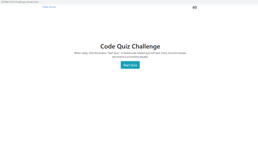

# Code-Quiz

  ## Description:
  A fast timed-quiz with code-related questions.  You have 60 seconds to answer all questions.  For every question answered wrong, a time penalty will be applied.  Your score is the remaining time when the quiz is completed.  All scores are posted on the "View Scores" link.

  ## Demo:
   

  ## Built with:
  HTML, CSS, and Javascript

  ## Website:
  https://github.com/johnrip89/Code-Quiz/
  https://johnrip89.github.io/Code-Quiz/

  ## Contribution:
  Made by John Ripplinger